# Learning Path

## Recommended Sequence

This toolkit is designed to be completed in order, building progressively on concepts.

```mermaid
flowchart TD
    A[🎯 Leadership Briefing<br/>30 min] --> B[📚 Foundation Module<br/>2 hours]
    B --> C[🔀 Decision Support<br/>1.5 hours]
    C --> D[📋 Assessment Templates<br/>2 hours]
    D --> E[💻 Case Studies<br/>4 hours]
    E --> F[📊 Visualization Tools<br/>2 hours]
    F --> G[✅ Competency Assessment<br/>30 min]
    G --> H[🌍 Regulatory Reference<br/>1 hour]
```

## Module Details

### Module 1: Leadership Briefing (30 min)

!!! note "Learning Objectives"

    - Explain why structured B-R is important
    - Summarize CIOMS WG XII key recommendations
    - Articulate the business case for B-R capability

**Materials:** CIOMS WG XII Executive Summary (PowerPoint)

---

### Module 2: Foundation (2 hours)

!!! note "Learning Objectives"

    - Define key B-R terminology
    - Describe the B-R maturity model
    - Apply the SBRF quick reference guide

**Materials:**

- BR_Glossary.docx
- Lifecycle_BR_Maturity_Model.docx
- SBRF_Quick_Reference_Guide.docx

---

### Module 3: Decision Support (1.5 hours)

!!! note "Learning Objectives"

    - Select appropriate patient preference methods
    - Navigate quantitative analysis decision trees
    - Choose risk minimization measures

**Materials:**

- Patient_Preference_Study_Selector.docx
- Quantitative_Analysis_Decision_Tree.docx
- RMM_Selection_Framework.docx

---

### Module 4: Assessment Templates (2 hours)

!!! note "Learning Objectives"

    - Complete a BRAD template
    - Build an effects table
    - Construct a value tree

**Materials:**

- BRAD_Template.docx
- Effects_Table_Template.xlsx
- Value_Tree_Builder.xlsx

---

### Module 5: Case Studies (4 hours)

!!! note "Learning Objectives"

    - Perform DOOR analysis on simulated data
    - Calculate MCDA scores
    - Interpret B-R results

**Materials:**

- DOOR_Analysis_Template.xlsx
- door_analysis.py (Python)
- MCDA_Calculation_Walkthrough.xlsx
- MCDA_Tutorial.docx
- Vaccine_BRA_Worked_Example.docx

**Interactive Option:** [DOOR Analysis Notebook](https://colab.research.google.com/github/nexvigilant/nv-BR-toolkit/blob/main/notebooks/DOOR_Analysis_Tutorial.ipynb)

---

### Module 6: Visualization Tools (2 hours)

!!! note "Learning Objectives"

    - Generate forest plots
    - Build heatmaps
    - Create tornado diagrams

**Materials:**

- Forest_Plot_Generator.xlsx
- Heatmap_Builder.xlsx
- MCDA_Decision_Model.xlsx
- Tornado_Plot_Template.xlsx

---

### Module 7: Competency Assessment (30 min)

!!! note "Learning Objectives"

    - Self-assess B-R knowledge
    - Identify development areas
    - Plan continued learning

**Materials:** BR_Self_Assessment_Quiz.docx

---

### Module 8: Regulatory Reference (1 hour)

!!! note "Learning Objectives"

    - Compare regulatory approaches globally
    - Understand regional requirements
    - Navigate regulatory landscape

**Materials:** Regulatory_Landscape_Comparison.docx

---

## Total Time Investment

| Component | Time |
|-----------|------|
| Core modules | ~13.5 hours |
| Optional Python exercises | ~2 hours |
| **Total** | **~15.5 hours** |

---

[Start with Module 1 →](../modules/01-leadership-briefing.md){ .md-button .md-button--primary }
