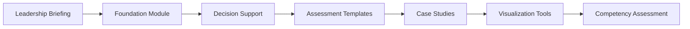

# NexVigilant Benefit-Risk Intelligence Toolkit

[](https://github.com/nexvigilant/nv-BR-toolkit)
[](https://creativecommons.org/licenses/by-nc-sa/4.0/)
[](https://github.com/nexvigilant/nv-BR-toolkit/actions/workflows/ci.yml)

A comprehensive educational toolkit for learning benefit-risk assessment methodologies in pharmaceutical development and pharmacovigilance.

---

!!! danger "IMPORTANT DISCLAIMER"

    **This toolkit is provided strictly for EDUCATIONAL and INSTRUCTIONAL purposes only.**

    - :x: **DO NOT** use this toolkit as a substitute for internal operating procedures
    - :x: **DO NOT** use these materials to inform regulatory decision-making
    - :x: **DO NOT** rely on these templates for actual regulatory submissions
    - :x: **DO NOT** use this code in production environments without proper validation

    This toolkit is designed to support learning and understanding of benefit-risk concepts. Any real-world application requires validated systems, qualified personnel, appropriate regulatory oversight, and organization-specific SOPs.

---

## What You'll Learn

<div class="grid cards" markdown>

-   :material-school:{ .lg .middle } **CIOMS WG XII Framework**

    ---

    Understand the comprehensive benefit-risk assessment framework established by CIOMS Working Group XII

-   :material-chart-tree:{ .lg .middle } **MCDA Methods**

    ---

    Learn Multi-Criteria Decision Analysis techniques for quantitative B-R assessment

-   :material-scale-balance:{ .lg .middle } **DOOR Analysis**

    ---

    Master Desirability of Outcome Ranking for composite endpoint evaluation

-   :material-file-document:{ .lg .middle } **Effects Tables**

    ---

    Build structured presentations of benefit and risk data

</div>

## Quick Start

### Option 1: Browse the Documentation

Navigate through the [Modules](modules/01-leadership-briefing.md) section to explore each component of the toolkit.

### Option 2: Interactive Notebooks

Launch the DOOR Analysis tutorial directly in Google Colab:

[](https://colab.research.google.com/github/nexvigilant/nv-BR-toolkit/blob/main/notebooks/DOOR_Analysis_Tutorial.ipynb)

### Option 3: Download the Toolkit

```bash
git clone https://github.com/nexvigilant/nv-BR-toolkit.git
cd nv-BR-toolkit
pip install -r requirements.txt
```

## Toolkit Structure

| Module | Description | Files |
|--------|-------------|-------|
| **01** | Leadership Briefing | CIOMS WG XII Executive Summary |
| **02** | Foundation | Glossary, Maturity Model, SBRF Guide |
| **03** | Decision Support | Patient Preferences, Decision Trees |
| **04** | Assessment Templates | BRAD, Effects Tables, Value Trees |
| **05** | Visualization Tools | Forest Plots, Heatmaps, MCDA, Tornado |
| **06** | Case Study Workbooks | DOOR Analysis, MCDA Walkthrough |
| **07** | Competency Assessment | Self-Assessment Quiz |
| **08** | Regulatory Reference | Multi-Regional Landscape |

## Recommended Learning Path



| Stage | Module | Time |
|-------|--------|------|
| 1 | Leadership Briefing | 30 min |
| 2 | Foundation Module | 2 hours |
| 3 | Decision Support | 1.5 hours |
| 4 | Assessment Templates | 2 hours |
| 5 | Case Study Workbooks | 4 hours |
| 6 | Visualization Tools | 2 hours |
| 7 | Competency Assessment | 30 min |
| 8 | Regulatory Reference | 1 hour |

---

## About NexVigilant

**NexVigilant** provides strategic pharmacovigilance intelligence and capability development for pharmaceutical professionals.

*Empowerment Through Vigilance.*

[Visit nexvigilant.com](https://www.nexvigilant.com){ .md-button .md-button--primary }
[View on GitHub](https://github.com/nexvigilant/nv-BR-toolkit){ .md-button }
