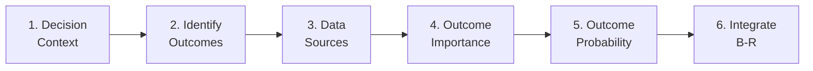

# Module 1: Leadership Briefing

!!! abstract "Time: 30 minutes"

    Executive overview of benefit-risk assessment based on CIOMS Working Group XII recommendations.

## Learning Objectives

After completing this module, you will be able to:

- [x] Explain why structured benefit-risk assessment matters
- [x] Summarize key CIOMS WG XII recommendations
- [x] Articulate the business case for B-R capability development

## Materials

| File | Description |
|------|-------------|
| `CIOMS_WG_XII_Executive_Summary.pptx` | PowerPoint presentation summarizing key framework elements |

## Key Concepts

### Why Structured B-R?

Traditional benefit-risk assessment often relies on:

- Implicit clinical judgment
- Inconsistent methods across products
- Limited transparency in decision rationale
- Difficulty communicating trade-offs

**Structured frameworks address these limitations** by providing systematic, transparent, and reproducible methods.

### CIOMS WG XII: Key Messages

!!! quote "CIOMS Working Group XII"

    "The benefit-risk balance should be assessed, documented, and communicated in a structured and consistent manner throughout the product lifecycle."

**Core principles:**

1. **Systematic** - Follow a defined process
2. **Transparent** - Document reasoning
3. **Stakeholder-inclusive** - Consider multiple perspectives
4. **Lifecycle-oriented** - Continuous reassessment

### The Structured Benefit-Risk Framework (SBRF)

## Discussion Questions

1. What are the current B-R practices in your organization?
2. Where do you see opportunities for more structured approaches?
3. What barriers might exist to implementing CIOMS recommendations?

---

[Continue to Module 2: Foundation →](02-foundation.md){ .md-button .md-button--primary }
