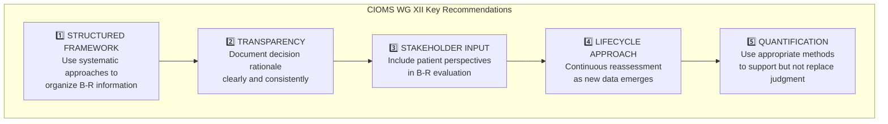
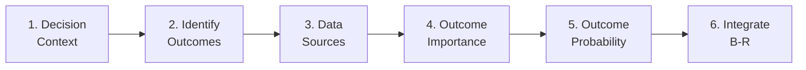

# Module 1: Leadership Briefing

!!! abstract "Time: 30 minutes"

    Executive overview of benefit-risk assessment based on CIOMS Working Group XII recommendations. Designed for PV leaders, medical directors, and regulatory strategists.

## Learning Objectives

After completing this module, you will be able to:

- [x] Explain why structured benefit-risk assessment matters for organizational success
- [x] Summarize the five key CIOMS WG XII recommendations
- [x] Articulate the business case for B-R capability development
- [x] Identify maturity indicators for your organization's B-R practices

## Materials

| File | Description |
|------|-------------|
| `CIOMS_WG_XII_Executive_Summary.pptx` | PowerPoint presentation summarizing key framework elements |

---

## The Strategic Imperative

### Why Structured B-R Assessment Matters Now

!!! danger "The Cost of Inconsistency"

    Organizations without structured B-R frameworks face:

    - **Regulatory delays** — Unclear documentation invites questions and requests for information
    - **Inconsistent decisions** — Different products assessed by different standards
    - **Stakeholder confusion** — Patients, HCPs, and regulators receive mixed messages
    - **Defensive positioning** — Unable to proactively communicate evolving B-R profile

Traditional benefit-risk assessment often relies on:

| Traditional Approach | Limitation |
|---------------------|------------|
| Implicit clinical judgment | Non-reproducible, person-dependent |
| Ad hoc methods | Inconsistent across products |
| Limited documentation | Decision rationale lost over time |
| Single-point evaluation | Doesn't reflect lifecycle evolution |

**Structured frameworks address these limitations** by providing systematic, transparent, and reproducible methods that withstand regulatory scrutiny and support confident decision-making.

---

## CIOMS WG XII: The Gold Standard

### Background

The **Council for International Organizations of Medical Sciences (CIOMS) Working Group XII** published comprehensive guidance on benefit-risk assessment in drug development. This landmark report—developed by international experts from regulatory authorities, pharmaceutical companies, and academia—establishes the foundational framework adopted by FDA, EMA, and other major regulators.

!!! success "Access the Source"

    [:material-book-open-variant: View CIOMS WG XII Publication](https://cioms.ch/publications/product/benefit-risk-balance-for-medicinal-products/){ .md-button .md-button--primary }

### Five Key Recommendations

#### 1. Structured Framework

> *"A systematic approach to organizing benefit-risk information improves consistency and transparency."*

**What this means:**
- Use a defined process (like SBRF) rather than ad hoc evaluation
- Organize evidence into consistent categories
- Enable comparison across products and time points

#### 2. Transparency

> *"Decision rationale should be documented clearly and consistently."*

**What this means:**
- Capture *why* decisions were made, not just *what* was decided
- Create auditable trail of evolving B-R assessment
- Enable meaningful review by diverse stakeholders

#### 3. Stakeholder Input

> *"Patient perspectives should inform benefit-risk evaluation."*

**What this means:**
- Incorporate patient preference studies where available
- Recognize that patients may weight outcomes differently than clinicians
- Design communication strategies for patient audiences

#### 4. Lifecycle Approach

> *"Benefit-risk assessment should evolve continuously as new data emerges."*

**What this means:**
- B-R is not a one-time evaluation at approval
- Signal detection should trigger B-R reassessment
- Periodic benefit-risk evaluation reports (PBRERs) should reflect genuine analysis

#### 5. Quantification (Where Appropriate)

> *"Quantitative methods can support but should not replace clinical judgment."*

**What this means:**
- Methods like MCDA, DOOR, and effects tables add rigor
- Numbers inform but don't automate decisions
- Uncertainty should be quantified and communicated

---

## The Structured Benefit-Risk Framework (SBRF)

The SBRF operationalizes CIOMS recommendations into a practical six-step process:

| Step | Key Questions | Deliverable |
|------|---------------|-------------|
| **1. Decision Context** | What decision? For whom? Compared to what? | Context document |
| **2. Identify Outcomes** | What benefits matter? What risks? | Outcome list |
| **3. Data Sources** | Where does evidence come from? Quality? | Evidence table |
| **4. Outcome Importance** | How important is each outcome? To whom? | Importance ranking |
| **5. Outcome Probability** | How likely is each outcome? Uncertainty? | Effects table |
| **6. Integrate B-R** | What is the overall balance? | B-R summary |

---

## The Business Case for B-R Capability

### Regulatory Environment

| Regulator | B-R Expectation |
|-----------|-----------------|
| **FDA** | Structured B-R discussion required in BLAs/NDAs (2013 guidance) |
| **EMA** | Effects tables standard in CHMP assessment reports |
| **ICH** | E2C(R2) requires B-R in PBRERs |
| **PMDA** | Increasingly aligned with ICH expectations |

### Competitive Advantage

!!! tip "Organizations with Mature B-R Capabilities..."

    - **Accelerate approvals** — Proactive B-R strategy reduces review cycles
    - **Defend decisions** — Documented rationale supports inspection readiness
    - **Enable lifecycle management** — Label updates, line extensions grounded in evidence
    - **Build regulatory relationships** — Demonstrate scientific rigor and transparency

### Maturity Indicators

Where does your organization stand?

| Level | Characteristics |
|-------|-----------------|
| **1 - Ad Hoc** | No consistent framework; assessment varies by reviewer |
| **2 - Developing** | Some tools in use; limited training; inconsistent application |
| **3 - Defined** | Standard framework adopted; templates in use; staff trained |
| **4 - Managed** | Consistent application; quality metrics tracked; continuous improvement |
| **5 - Optimized** | Integrated into product strategy; advanced methods; thought leadership |

---

## Discussion Questions

!!! question "For Leadership Teams"

    1. **Current State:** What are the current B-R practices in your organization? Which maturity level describes you today?

    2. **Gap Analysis:** Where do you see opportunities for more structured approaches? What's the business case for investment?

    3. **Implementation:** What barriers might exist to implementing CIOMS recommendations? How would you address them?

    4. **Measurement:** How would you know if B-R capability improvements are successful? What metrics matter?

---

## Key Takeaways

!!! success "Executive Summary"

    1. **Structured B-R is now expected** — Regulators require systematic, documented assessment
    2. **CIOMS WG XII provides the blueprint** — Five recommendations operationalized through SBRF
    3. **Capability investment pays returns** — Faster approvals, stronger defense, better decisions
    4. **Maturity is a journey** — Start where you are, build incrementally

---

## Next Steps

| Action | Resource |
|--------|----------|
| Understand the fundamentals | [Module 2: Foundation](02-foundation.md) |
| Explore decision support tools | [Module 3: Decision Support](03-decision-support.md) |
| See the framework in action | [Module 6: Case Studies](06-case-studies.md) |
| Reference the source | [CIOMS WG XII](../reference/cioms-wg-xii.md) |

---

[Continue to Module 2: Foundation →](02-foundation.md){ .md-button .md-button--primary }
