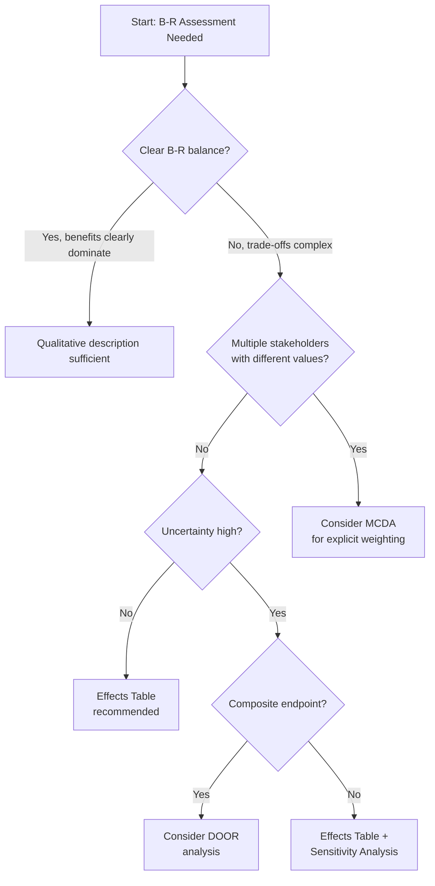
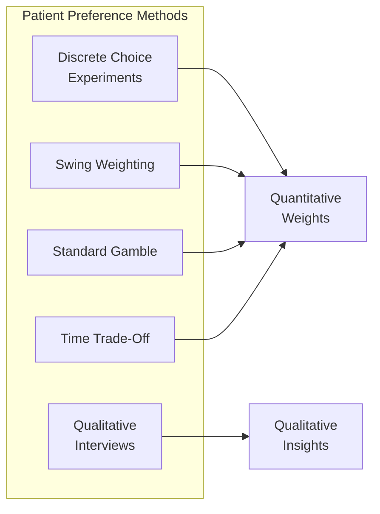
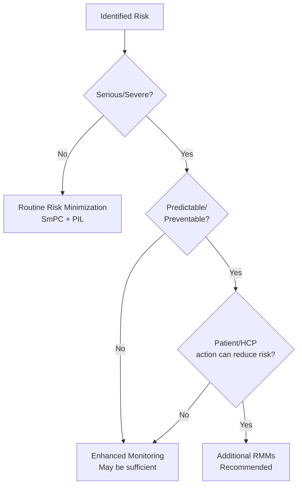

# Module 3: Decision Support

!!! abstract "Time: 1.5 hours"

    Decision frameworks for selecting appropriate B-R methods, incorporating patient preferences, and choosing risk minimization measures.

## Learning Objectives

After completing this module, you will be able to:

- [x] Select appropriate quantitative methods based on decision context
- [x] Explain how patient preferences inform B-R assessment
- [x] Apply decision trees for method selection
- [x] Identify when risk minimization measures are needed

## Materials

| File | Description |
|------|-------------|
| `Patient_Preference_Study_Selector.docx` | Guide to patient preference methods |
| `Quantitative_Analysis_Decision_Tree.docx` | When to use quantitative B-R |
| `RMM_Selection_Framework.docx` | Risk minimization measure selection |

---

## The Decision Support Challenge

!!! question "Key Questions in B-R Assessment"

    When facing a benefit-risk evaluation, decision-makers encounter critical choice points:

    1. **Which method?** — Qualitative description, effects table, MCDA, or DOOR?
    2. **Whose values?** — How do we incorporate patient perspectives?
    3. **What comparator?** — Placebo, active control, or standard of care?
    4. **What actions?** — When are risk minimization measures needed?

This module provides frameworks to navigate these decisions systematically.

---

## Part 1: Quantitative Method Selection

### Decision Tree: When to Quantify

Not every B-R assessment requires quantitative methods. Use this decision framework:

### Method Selection Guide

| Situation | Recommended Method | Rationale |
|-----------|-------------------|-----------|
| Clear benefit dominance | Qualitative narrative | Quantification adds no value |
| Comparable benefits & risks | Effects Table | Structured comparison |
| Multiple outcomes with trade-offs | MCDA | Explicit value weighting |
| Composite endpoints | DOOR | Respects clinical hierarchy |
| High uncertainty | Any + Sensitivity Analysis | Explore parameter ranges |
| Regulatory submission | Effects Table + MCDA | Demonstrates rigor |

### Practical Example

**Scenario:** New oral anticoagulant for atrial fibrillation

| Factor | Assessment | Method Implication |
|--------|------------|-------------------|
| Multiple outcomes | Stroke, MI, bleeding, death | → Effects Table minimum |
| Trade-off exists | Efficacy vs bleeding | → Quantification needed |
| Patient values vary | Some prioritize stroke prevention, others bleeding risk | → Consider MCDA |
| Composite endpoint used | MACE | → DOOR appropriate |

**Conclusion:** This scenario warrants an Effects Table with MCDA for sensitivity analysis, and DOOR analysis for the composite endpoint.

---

## Part 2: Patient Preferences in B-R

### Why Patient Preferences Matter

!!! tip "CIOMS WG XII Principle"

    "Patient perspectives should inform benefit-risk evaluation."

Patients may weight outcomes differently than clinicians:

| Outcome | Clinician Priority | Patient Priority |
|---------|-------------------|------------------|
| All-cause mortality | Very High | Very High |
| Hospitalization | High | Moderate (depends on duration) |
| Daily pill burden | Low | High (impacts adherence) |
| Injection frequency | Moderate | Very High (needle phobia) |
| Cosmetic side effects | Low | High (quality of life) |

### Patient Preference Study Methods

#### Method Comparison

| Method | Complexity | Output | Best For |
|--------|------------|--------|----------|
| **Discrete Choice Experiments (DCE)** | High | Utility weights, WTP | Regulatory submissions |
| **Swing Weighting** | Moderate | Normalized weights | MCDA input |
| **Standard Gamble** | Moderate | QALY weights | Health economics |
| **Time Trade-Off** | Moderate | QALY weights | Chronic conditions |
| **Qualitative Interviews** | Low | Themes, priorities | Early development |

### When to Conduct Preference Studies

!!! warning "Resource Considerations"

    Patient preference studies require significant time and resources. Consider:

    - **Phase 2-3 transition** — Inform pivotal trial endpoint selection
    - **Pre-submission** — Support regulatory B-R narrative
    - **Post-approval** — Inform label updates and RMMs
    - **Payer discussions** — Demonstrate patient value

### Preference Study Decision Matrix

| Decision Point | Study Recommended? | Type |
|----------------|-------------------|------|
| Clear B-R, no controversy | No | N/A |
| Close B-R balance | Yes | DCE or Swing Weighting |
| First-in-class therapy | Yes | Qualitative + DCE |
| Pediatric indication | Yes | Parent/caregiver + age-appropriate |
| Rare disease | Consider | May be challenging to recruit |

---

## Part 3: Risk Minimization Measures

### When Are RMMs Needed?

Risk Minimization Measures (RMMs) go beyond the label to actively reduce risk occurrence or severity.

### RMM Selection Framework

| Risk Type | Example | Potential RMMs |
|-----------|---------|----------------|
| **Drug-drug interaction** | QT prolongation with CYP inhibitors | Contraindication, HCP training |
| **Laboratory monitoring** | Hepatotoxicity | Monitoring program, patient card |
| **Administration** | Injection site reactions | Patient training, nurse administration |
| **Pregnancy exposure** | Teratogenicity | Pregnancy prevention program (PPP) |
| **Misuse potential** | Opioid addiction | Controlled distribution, prescriber training |

### RMM Types and Applications

#### Tier 1: Routine (All Products)

- Summary of Product Characteristics (SmPC)
- Patient Information Leaflet (PIL)
- Appropriate pack size and strength

#### Tier 2: Additional Educational

| Measure | Purpose | Example |
|---------|---------|---------|
| Healthcare Professional Guide | Ensure safe prescribing | Immunosuppressant protocols |
| Patient Guide | Support safe use | Anticoagulant patient cards |
| Checklist | Standardize process | Pre-treatment screening |

#### Tier 3: Controlled Access

| Measure | Purpose | Example |
|---------|---------|---------|
| Restricted Distribution | Limit access | Thalidomide analogs |
| Prescriber Certification | Ensure competence | Clozapine REMS |
| Pregnancy Prevention Program | Prevent fetal exposure | Isotretinoin iPLEDGE |

### RMM Effectiveness Evaluation

!!! danger "Common Pitfall"

    RMMs are only effective if implemented correctly. Plan for evaluation:

| Metric | Data Source | Target |
|--------|-------------|--------|
| HCP awareness | Survey | >80% |
| Patient card distribution | Pharmacy data | >90% |
| Monitoring compliance | Claims/registry | >75% |
| Risk incidence | Spontaneous reports, studies | Decreasing trend |

---

## Part 4: Decision Context Scenarios

### Scenario 1: Novel Oncology Agent

**Context:** First-line treatment for advanced NSCLC with EGFR mutation

| Factor | Value |
|--------|-------|
| Unmet need | High (limited options) |
| Efficacy | PFS improvement, OS pending |
| Key risks | Pneumonitis, hepatotoxicity |
| Patient population | Performance status 0-1 |

**Decision Support Analysis:**

1. **Method Selection** → Effects Table + Tornado diagram (uncertainty in OS)
2. **Patient Preferences** → Consider DCE for trade-off between PFS and toxicity
3. **RMMs Needed?** → Yes, monitoring programs for pneumonitis/hepatotoxicity

### Scenario 2: Chronic Disease Oral Therapy

**Context:** Add-on therapy for type 2 diabetes

| Factor | Value |
|--------|-------|
| Unmet need | Moderate (alternatives exist) |
| Efficacy | HbA1c reduction, CV outcomes |
| Key risks | GI events, hypoglycemia, weight |
| Patient population | Diverse, many comorbidities |

**Decision Support Analysis:**

1. **Method Selection** → Effects Table + MCDA (multiple outcomes, patient values vary)
2. **Patient Preferences** → Critical (daily adherence required, QoL matters)
3. **RMMs Needed?** → Routine sufficient if hypoglycemia risk managed by label

---

## Key Takeaways

!!! success "Decision Support Principles"

    1. **Match method to complexity** — Don't over-engineer simple decisions
    2. **Patient voice matters** — Incorporate preferences explicitly where possible
    3. **RMMs require planning** — Design for effectiveness, not just compliance
    4. **Document rationale** — Explain why methods and measures were selected

---

## Discussion Questions

!!! question "Apply Your Learning"

    1. For a product you're familiar with, which quantitative method would be most appropriate? Why?

    2. When would you recommend against conducting a patient preference study?

    3. What makes an RMM effective vs. merely compliant?

---

## Further Resources

| Resource | Description |
|----------|-------------|
| [Module 4: Assessment Templates](04-assessment-templates.md) | Apply these decisions using templates |
| [Module 5: Visualization Tools](05-visualization-tools.md) | Create visualizations for each method |
| [DOOR Analysis Tutorial](../interactive/door-analysis.md) | Hands-on with DOOR methodology |
| [Glossary](../reference/glossary.md) | Term definitions (MCDA, RMM, DCE) |

---

!!! warning "Educational Disclaimer"

    This module is provided for **educational purposes only**. Decision frameworks should be validated with your organization's methodologists and regulatory teams before application.

---

[Continue to Module 4: Assessment Templates →](04-assessment-templates.md){ .md-button .md-button--primary }

---

**NexVigilant** | *Empowerment Through Vigilance*
