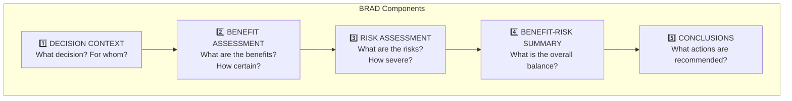

# Module 4: Assessment Templates

!!! abstract "Time: 2 hours"

    Hands-on templates for documenting benefit-risk assessments. Master the BRAD, Effects Table, and Value Tree—the three core deliverables of structured B-R assessment.

## Learning Objectives

After completing this module, you will be able to:

- [x] Complete a Benefit-Risk Action Document (BRAD) template
- [x] Construct an effects table with appropriate metrics
- [x] Build a value tree for comprehensive outcome identification
- [x] Apply templates to real-world scenarios

## Materials

| File | Description |
|------|-------------|
| `BRAD_Template.docx` | Benefit-Risk Action Document template |
| `Effects_Table_Template.xlsx` | Structured effects table |
| `Value_Tree_Builder.xlsx` | Value tree construction tool |

---

## Template 1: Benefit-Risk Action Document (BRAD)

### What is a BRAD?

The **Benefit-Risk Action Document** is a living document that captures the evolving B-R profile throughout a product's lifecycle. Developed by FDA, it provides a standardized structure for regulatory communication.

!!! tip "Key Principle"

    The BRAD tells the **story** of benefit-risk—why this product, for this population, at this time, represents an acceptable balance.

### BRAD Structure



### Section-by-Section Guide

#### Section 1: Decision Context

| Element | Description | Example |
|---------|-------------|---------|
| **Indication** | Disease/condition being treated | Moderate-to-severe rheumatoid arthritis |
| **Population** | Target patient characteristics | Adults with inadequate response to DMARDs |
| **Comparator** | What is the alternative? | MTX + placebo, other biologics |
| **Decision** | What are we deciding? | Initial approval vs standard of care |
| **Timeframe** | When is decision needed? | PDUFA date: [date] |

#### Section 2: Benefit Assessment

| Benefit | Metric | Treatment | Comparator | Difference | Uncertainty |
|---------|--------|-----------|------------|------------|-------------|
| ACR20 response | % at Week 24 | 62% | 35% | +27% | 95% CI: 20-34% |
| DAS28 remission | % at Week 52 | 28% | 8% | +20% | 95% CI: 14-26% |
| Radiographic progression | Mean change | 0.3 | 1.4 | -1.1 | p<0.001 |
| Physical function | HAQ-DI change | -0.6 | -0.2 | -0.4 | 95% CI: -0.5, -0.3 |

**Summary:** Meaningful improvements across clinical response, remission, structural, and functional endpoints.

#### Section 3: Risk Assessment

| Risk | Incidence (Trt) | Incidence (Ctrl) | Severity | Mitigation |
|------|-----------------|------------------|----------|------------|
| Serious infections | 3.2% | 1.8% | Serious | Screening, monitoring |
| Malignancy | 0.8% | 0.6% | Serious | Ongoing surveillance |
| Hepatic events | 2.1% | 1.2% | Moderate | LFT monitoring |
| Injection site reactions | 8.4% | 2.1% | Mild | Patient education |

**Summary:** Elevated infection risk consistent with mechanism; manageable with standard monitoring.

#### Section 4: Benefit-Risk Summary

!!! example "Summary Statement Template"

    For patients with **[indication]** who **[population characteristics]**, **[product name]** provides **[key benefits]** that outweigh **[key risks]** when used according to the proposed labeling, which includes **[key mitigation measures]**.

#### Section 5: Conclusions and Actions

| Recommendation | Rationale |
|----------------|-----------|
| Approve for proposed indication | Benefits meaningfully outweigh risks |
| Include contraindication for active infection | Serious infection risk |
| Require LFT monitoring per label | Hepatic safety signal |
| Conduct post-marketing study | Long-term malignancy data needed |

---

## Template 2: Effects Table

### What is an Effects Table?

The **Effects Table** is a structured presentation of key benefits and risks with quantitative data. It's the workhorse of B-R communication—used by EMA in assessment reports and increasingly by FDA.

### Effects Table Format

| Outcome | Treatment<br/>N=500 | Comparator<br/>N=500 | Absolute<br/>Difference | Relative<br/>Measure | 95% CI | Importance |
|---------|---------------------|----------------------|------------------------|---------------------|--------|------------|
| **BENEFITS** | | | | | | |
| Primary efficacy | 62% | 35% | +27% | RR 1.77 | 1.5-2.1 | Critical |
| Remission | 28% | 8% | +20% | RR 3.50 | 2.3-5.3 | Important |
| **RISKS** | | | | | | |
| Serious infection | 3.2% | 1.8% | +1.4% | RR 1.78 | 1.1-2.9 | Critical |
| Hepatic AE | 2.1% | 1.2% | +0.9% | RR 1.75 | 0.9-3.4 | Important |
| Injection site | 8.4% | 2.1% | +6.3% | RR 4.00 | 2.6-6.2 | Minor |

### Effects Table Best Practices

!!! success "Do"

    - Include both absolute and relative measures
    - Report confidence intervals (uncertainty matters)
    - Use consistent denominators
    - Rank outcomes by importance
    - Include both benefits AND risks in one table

!!! danger "Don't"

    - Mix different timepoints without noting
    - Report only p-values (need effect sizes)
    - Exclude unfavorable outcomes
    - Use different populations for benefits vs risks
    - Overcomplicate with too many outcomes

### Effects Table Metrics Guide

| Metric | When to Use | Interpretation |
|--------|-------------|----------------|
| **Absolute Risk Difference** | Always | Direct difference in event rates |
| **Relative Risk (RR)** | Common events | Ratio of event rates |
| **Odds Ratio (OR)** | Rare events, case-control | Approximates RR when events rare |
| **Hazard Ratio (HR)** | Time-to-event | Instantaneous risk ratio |
| **NNT/NNH** | Patient communication | Number needed to treat/harm |

### Calculating NNT and NNH

```
NNT = 1 / Absolute Risk Reduction
NNH = 1 / Absolute Risk Increase
```

**Example from table above:**

- **NNT for ACR20:** 1 / 0.27 = 3.7 → Treat 4 patients for 1 additional responder
- **NNH for Serious Infection:** 1 / 0.014 = 71 → 71 patients treated for 1 additional serious infection

---

## Template 3: Value Tree

### What is a Value Tree?

A **Value Tree** is a hierarchical representation of benefit and risk factors, ensuring comprehensive outcome identification and providing structure for MCDA.

### Value Tree Structure

```
Benefit-Risk Assessment
├── BENEFITS
│   ├── Efficacy
│   │   ├── Disease response (ACR20/50/70)
│   │   ├── Remission (DAS28-CRP)
│   │   └── Structural progression
│   ├── Function
│   │   ├── Physical function (HAQ-DI)
│   │   └── Quality of life (SF-36)
│   └── Convenience
│       ├── Dosing frequency
│       └── Route of administration
│
└── RISKS
    ├── Efficacy Failures
    │   ├── Non-response
    │   └── Loss of response
    ├── Safety
    │   ├── Serious
    │   │   ├── Serious infections
    │   │   ├── Malignancy
    │   │   └── CV events
    │   └── Non-serious
    │       ├── Injection site reactions
    │       ├── Hepatic events
    │       └── Headache
    └── Tolerability
        ├── Discontinuation due to AE
        └── Quality of life impact
```

### Building a Value Tree: Step-by-Step

#### Step 1: Identify Top-Level Categories

| Category | Definition |
|----------|------------|
| **Benefits** | Favorable effects supporting use |
| **Risks** | Unfavorable effects concerning use |

#### Step 2: Define Subcategories

| Benefit Subcategories | Risk Subcategories |
|----------------------|-------------------|
| Efficacy (disease control) | Safety (adverse events) |
| Function (physical/cognitive) | Tolerability (discontinuation) |
| Convenience (administration) | Efficacy failures (non-response) |
| Quality of life | Burden (monitoring, cost) |

#### Step 3: Populate Specific Outcomes

!!! tip "Completeness Check"

    For each subcategory, ask:

    - What outcomes are **measured in trials**?
    - What outcomes **matter to patients**?
    - What outcomes are **requested by regulators**?
    - What outcomes are **relevant to this decision context**?

#### Step 4: Validate with Stakeholders

- Clinical team: Are all relevant outcomes included?
- Regulatory: Does this align with agency expectations?
- Patients: Are patient-relevant outcomes represented?

### Value Tree Quality Criteria

| Criterion | Definition | Check |
|-----------|------------|-------|
| **Complete** | All relevant outcomes included | ☐ |
| **Non-redundant** | No double-counting | ☐ |
| **Measurable** | Each outcome can be quantified | ☐ |
| **Preference-independent** | Outcomes don't inherently depend on each other | ☐ |

---

## Worked Example: Putting It Together

### Scenario: Novel JAK Inhibitor for Rheumatoid Arthritis

Let's apply all three templates to a hypothetical JAK inhibitor.

#### Value Tree (Outcome Identification)

```
NEXJAK Benefit-Risk
├── BENEFITS
│   ├── Efficacy
│   │   ├── ACR20/50/70 response
│   │   ├── DAS28-CRP remission
│   │   └── Radiographic non-progression
│   ├── Function
│   │   └── HAQ-DI improvement
│   └── Convenience
│       └── Oral administration (vs injection)
│
└── RISKS
    ├── Safety
    │   ├── Serious infections
    │   ├── Herpes zoster
    │   ├── VTE
    │   └── MACE
    ├── Laboratory
    │   ├── Liver enzyme elevation
    │   └── Lipid elevation
    └── Tolerability
        └── GI events
```

#### Effects Table (Quantification)

| Outcome | NEXJAK | Placebo | Difference | 95% CI | Rating |
|---------|--------|---------|------------|--------|--------|
| **BENEFITS** | | | | | |
| ACR20 (W12) | 67% | 28% | +39% | 32-46% | Critical |
| DAS28 remission | 31% | 6% | +25% | 19-31% | Important |
| HAQ-DI ≥0.22 | 58% | 32% | +26% | 19-33% | Important |
| **RISKS** | | | | | |
| Serious infection | 2.8% | 1.1% | +1.7% | 0.4-3.0% | Critical |
| Herpes zoster | 3.9% | 0.4% | +3.5% | 2.1-4.9% | Important |
| VTE | 0.6% | 0.1% | +0.5% | 0.1-0.9% | Critical |
| ALT >3x ULN | 1.8% | 0.9% | +0.9% | -0.2-2.0% | Moderate |

#### BRAD Summary

!!! example "NEXJAK Benefit-Risk Summary"

    For adults with moderately-to-severely active rheumatoid arthritis who have had inadequate response to MTX, **NEXJAK 15mg once daily** provides clinically meaningful improvements in signs/symptoms (ACR20 +39%), remission rates (DAS28 +25%), and physical function (HAQ-DI responders +26%).

    These benefits must be weighed against elevated risks of serious infections (+1.7%), herpes zoster (+3.5%), and VTE (+0.5%). The oral route offers convenience over injectable biologics.

    **Conclusion:** Benefits outweigh risks for the proposed population when used with appropriate screening (infection, VTE risk factors), monitoring (LFTs, lipids), and contraindications (active infection, pregnancy).

---

## Key Takeaways

!!! success "Template Mastery"

    1. **BRAD** tells the story — narrative structure for decision-makers
    2. **Effects Table** provides the evidence — quantified, comparable data
    3. **Value Tree** ensures completeness — systematic outcome identification
    4. **Use together** — Value Tree → Effects Table → BRAD narrative

---

## Practice Exercise

!!! question "Apply Your Learning"

    Using the templates provided, create a B-R assessment for one of these scenarios:

    1. **GLP-1 agonist** for weight management (efficacy: weight loss; risks: GI events, thyroid)
    2. **PCSK9 inhibitor** for hypercholesterolemia (efficacy: LDL reduction; risks: injection site, neurocognitive)
    3. **Gene therapy** for hemophilia (efficacy: bleed reduction; risks: immunogenicity, cancer)

---

## Further Resources

| Resource | Description |
|----------|-------------|
| [Module 5: Visualization Tools](05-visualization-tools.md) | Visualize your effects tables |
| [Module 6: Case Studies](06-case-studies.md) | See complete worked examples |
| [Glossary: BRAD](../reference/glossary.md#b) | Definition and context |
| [Glossary: Effects Table](../reference/glossary.md#e) | Definition and example |

---

!!! warning "Educational Disclaimer"

    This module is provided for **educational purposes only**. Templates should be adapted to your organization's SOPs and validated by regulatory affairs before use in submissions.

---

[Continue to Module 5: Visualization Tools →](05-visualization-tools.md){ .md-button .md-button--primary }

---

**NexVigilant** | *Empowerment Through Vigilance*
