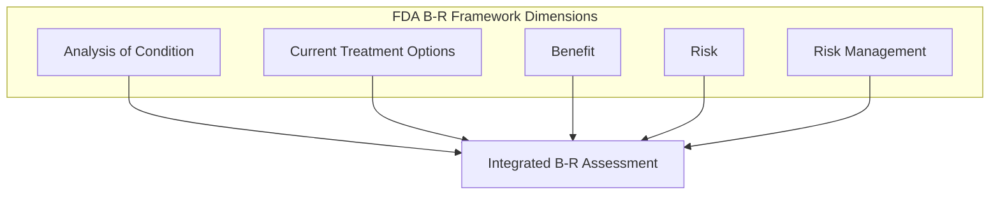

# Module 8: Regulatory Reference

!!! abstract "Time: 1.5 hours"

    Global regulatory landscape for benefit-risk assessment frameworks, guidance documents, and submission expectations.

---

## Learning Objectives

By the end of this module, you will be able to:

1. **Compare** B-R assessment frameworks across major regulatory agencies
2. **Identify** key guidance documents and their requirements
3. **Apply** ICH harmonized approaches to B-R documentation
4. **Navigate** regional differences in submission expectations
5. **Reference** authoritative sources for current requirements

---

## Materials

| File | Description |
|------|-------------|
| `Regulatory_Landscape_Comparison.docx` | Multi-regional B-R requirements |

---

## ICH Guidelines Foundation

The **International Council for Harmonisation (ICH)** provides the foundation for global B-R assessment practices.

### Key ICH Guidelines

| Guideline | Title | B-R Relevance |
|-----------|-------|---------------|
| **E1** | Population Exposure | Safety database sizing for benefit-risk context |
| **E2A** | Clinical Safety Data Management | AE definitions, causality assessment |
| **E2C(R2)** | Periodic Safety Update Reports | Ongoing benefit-risk evaluation |
| **E2D** | Post-Approval Safety Reporting | Signal detection, expedited reporting |
| **E2E** | Pharmacovigilance Planning | Risk identification, characterization |
| **M4E(R2)** | CTD Efficacy | Benefit-risk summary in Module 2.5 |

### E2E: Pharmacovigilance Planning

The ICH E2E guideline specifically addresses benefit-risk throughout the product lifecycle:

```
SAFETY SPECIFICATION STRUCTURE
│
├── Module SI: Epidemiology
│   └── Disease context for benefit-risk
│
├── Module SII: Non-clinical Safety
│   └── Preclinical signals informing risk
│
├── Module SIII: Clinical Trial Exposure
│   └── Safety database adequacy
│
├── Module SIV: Populations Not Studied
│   └── Missing information for B-R
│
├── Module SV: Identified & Potential Risks
│   └── Core risk characterization
│
├── Module SVI: Identified Benefits
│   └── Efficacy data supporting benefit
│
└── Module SVII: Summary of Safety Concerns
    └── Integrated benefit-risk context
```

### M4E(R2): CTD Benefit-Risk Summary

Module 2.5 of the Common Technical Document requires:

| Section | Content | Guidance |
|---------|---------|----------|
| **2.5.1** | Product Development Rationale | Unmet need, therapeutic context |
| **2.5.4** | Overview of Efficacy | Benefit evidence summary |
| **2.5.5** | Overview of Safety | Risk characterization |
| **2.5.6** | Benefit-Risk Conclusions | Integrated assessment, labeling basis |

---

## FDA Framework (United States)

### PDUFA Structured B-R Framework

FDA's Benefit-Risk Framework, implemented under PDUFA V, provides a structured approach:



### Five Dimensions Explained

| Dimension | Key Questions | Evidence Sources |
|-----------|---------------|------------------|
| **Analysis of Condition** | Severity? Morbidity/mortality? Symptoms? | Epidemiology, natural history, patient perspectives |
| **Current Treatment Options** | What alternatives exist? Unmet need? | Treatment landscape, gaps in current care |
| **Benefit** | What efficacy was demonstrated? Magnitude? Duration? | Clinical trial data, PROs, surrogate endpoints |
| **Risk** | What are the identified and potential risks? | Safety database, mechanism of action, class effects |
| **Risk Management** | How can risks be mitigated? | Labeling, REMS, post-marketing studies |

### Key FDA Guidance Documents

| Document | Year | Focus |
|----------|------|-------|
| **Structured Approach to B-R Assessment** | 2018 | Framework implementation guide |
| **Patient-Focused Drug Development** | 2020-2023 | Incorporating patient preferences |
| **Rare Disease B-R Considerations** | 2019 | Flexibility for small populations |
| **REMS Assessment Guidance** | 2019 | Risk Evaluation and Mitigation Strategies |
| **Postmarketing Safety Reporting** | 2001 (updated) | 15-day and periodic reporting |

### REMS Requirements

Risk Evaluation and Mitigation Strategies may be required when:

- Serious risks cannot be adequately addressed through labeling alone
- Benefits outweigh risks only with risk minimization measures
- Specific monitoring, restricted distribution, or patient enrollment is needed

| REMS Element | Description | Example |
|--------------|-------------|---------|
| **Medication Guide** | Patient-directed risk information | Antidepressant black box |
| **Communication Plan** | HCP education | Dear Healthcare Provider letters |
| **ETASU** | Elements to Assure Safe Use | Restricted distribution networks |
| **Implementation System** | Operational requirements | Prescriber certification |

---

## EMA Framework (European Union)

### CHMP Benefit-Risk Methodology

The EMA's Committee for Medicinal Products for Human Use (CHMP) uses the **PrOACT-URL** framework:

| Step | Description |
|------|-------------|
| **Pr**oblem | Define the decision context |
| **O**bjectives | Identify relevant outcomes |
| **A**lternatives | Consider treatment options |
| **C**onsequences | Assess outcome probabilities |
| **T**rade-offs | Weigh benefits against risks |
| **U**ncertainty | Characterize data limitations |
| **R**isk Tolerance | Consider stakeholder preferences |
| **L**inked Decisions | Address post-approval commitments |

### Effects Table Requirement

EMA specifically requires an **Effects Table** in assessment reports:

| Outcome | Drug | Comparator | Difference | Uncertainty |
|---------|------|------------|------------|-------------|
| Primary endpoint | X% | Y% | +Z% | 95% CI |
| Key secondary | | | | |
| Serious AE | | | | |
| Common AEs | | | | |

### Key EMA Guidance

| Document | Reference | Content |
|----------|-----------|---------|
| **Guideline on Good Pharmacovigilance Practices** | GVP Module V | Risk management systems |
| **GVP Module VII** | | Periodic safety update reports |
| **GVP Module IX** | | Signal management |
| **Benefit-Risk Methodology Project** | 2012 | EMA B-R assessment report |
| **CHMP AR Template** | Current | Assessment report format |

### EU Risk Management Plan (RMP)

The RMP is a **mandatory** submission component in the EU:

```
RMP STRUCTURE
│
├── Part I: Product Overview
│
├── Part II: Safety Specification
│   ├── Module SI: Epidemiology
│   ├── Module SII: Non-clinical
│   ├── Module SIII: Clinical trial exposure
│   ├── Module SIV: Populations not studied
│   ├── Module SV: Post-authorization experience
│   ├── Module SVI: Identified & potential risks
│   ├── Module SVII: Identified & potential risks summary
│   └── Module SVIII: Summary of safety concerns
│
├── Part III: Pharmacovigilance Plan
│
├── Part IV: Post-Authorization Efficacy Studies
│
├── Part V: Risk Minimisation Measures
│
├── Part VI: Summary of RMP
│
└── Part VII: Annexes (incl. EU-RMP Summary)
```

---

## Health Canada

### Benefit-Risk Approach

Health Canada's review process integrates B-R assessment throughout:

| Review Phase | B-R Activities |
|--------------|----------------|
| **Pre-submission** | Therapeutic context, comparator definition |
| **Screening** | Preliminary B-R signal identification |
| **Clinical Review** | Efficacy and safety evaluation |
| **B-R Integration** | Weighing evidence, labeling decisions |
| **Authorization** | Benefit-risk conclusion, NOC conditions |

### Key Documents

- **Common Technical Document (CTD)** — Harmonized with ICH
- **Benefit-Risk Assessment Framework** — Similar to FDA 5 dimensions
- **Risk Management Plan** — Aligned with EU RMP structure
- **Product Monograph** — Canadian equivalent of USPI

---

## PMDA (Japan)

### Japanese Regulatory Framework

| Aspect | Approach |
|--------|----------|
| **Clinical Data** | Japanese bridging studies often required |
| **Ethnic Sensitivity** | ICH E5 considerations |
| **B-R Documentation** | CTD format with Japanese context |
| **Risk Management** | Risk Management Plan (J-RMP) |
| **Post-Marketing** | All-case surveillance for some products |

### J-RMP Structure

Similar to EU RMP but with Japan-specific considerations:

- **Identified Risks** — Including Japan-specific AEs
- **Potential Risks** — Pharmacogenomic considerations
- **Missing Information** — Japanese pediatric/elderly data
- **Pharmacovigilance Activities** — Enhanced surveillance programs

---

## TGA (Australia)

### Australian Regulatory Review

| Element | Description |
|---------|-------------|
| **Delegate's Overview** | B-R summary and recommendation |
| **AusPAR** | Australian Public Assessment Report |
| **Risk Management** | Risk Management Plan (AU-RMP) |
| **Black Box Warnings** | Risk communication approach |

### Key Features

- Strong reliance on international assessment reports
- Emphasis on Australian population relevance
- Post-market review programs
- Medicine scheduling considerations

---

## Multi-Regional Comparison

### B-R Framework Comparison

| Aspect | FDA | EMA | Health Canada | PMDA | TGA |
|--------|-----|-----|---------------|------|-----|
| **Formal Framework** | 5 Dimensions | PrOACT-URL | 5 Dimensions | CTD-based | Delegate review |
| **Effects Table** | Encouraged | Required | Encouraged | Encouraged | Encouraged |
| **RMP Required** | REMS (selective) | Yes (all) | Yes | Yes (J-RMP) | Yes |
| **Public AR** | Review memo | EPAR | Summary Basis | Review report | AusPAR |
| **Patient Input** | PFDD programs | EMA PRIME | Patient group | Limited formal | Limited formal |

### Documentation Requirements

| Document Type | FDA | EMA | HC | PMDA | TGA |
|---------------|-----|-----|-----|------|-----|
| **CTD Module 2.5** | ✓ | ✓ | ✓ | ✓ | ✓ |
| **Benefit Summary** | ✓ | ✓ | ✓ | ✓ | ✓ |
| **Safety Summary** | ✓ | ✓ | ✓ | ✓ | ✓ |
| **Effects Table** | Optional | Required | Optional | Optional | Optional |
| **Value Tree** | Optional | Encouraged | Optional | Rare | Optional |
| **Quantitative B-R** | Encouraged | Encouraged | Optional | Rare | Optional |
| **Patient Preference** | Encouraged | Encouraged | Optional | Limited | Optional |

### Post-Approval Commitments

| Commitment Type | When Required |
|-----------------|---------------|
| **Confirmatory Trials** | Accelerated/conditional approval |
| **PASS/PAES** | Safety/efficacy uncertainties |
| **Enhanced PV** | Signal monitoring requirements |
| **Registries** | Long-term safety data collection |
| **REMS Assessments** | US REMS-specific |

---

## Practical Application

### Global Submission Checklist

For multi-regional B-R documentation:

- [ ] CTD Module 2.5 B-R summary complete
- [ ] Effects Table prepared (EMA requirement)
- [ ] Value Tree documented (if using MCDA)
- [ ] Regional differences addressed:
    - [ ] FDA: REMS assessment if applicable
    - [ ] EMA: RMP prepared per GVP Module V
    - [ ] Japan: Ethnic sensitivity addressed (ICH E5)
    - [ ] Canada: Canadian-specific context
    - [ ] Australia: AU-specific considerations

### Key Reference URLs

!!! info "Authoritative Sources"

    **ICH Guidelines**

    - ICH E2E: [ich.org/page/efficacy-guidelines](https://www.ich.org/page/efficacy-guidelines)
    - ICH M4E: [ich.org/page/ctd](https://www.ich.org/page/ctd)

    **FDA**

    - B-R Framework: [fda.gov/drugs/benefit-risk-assessment](https://www.fda.gov/drugs/development-approval-process-drugs/benefit-risk-assessment-drug-review-decisions)
    - REMS: [fda.gov/drugs/rems](https://www.fda.gov/drugs/drug-safety-and-availability/risk-evaluation-and-mitigation-strategies-rems)

    **EMA**

    - GVP Modules: [ema.europa.eu/gvp](https://www.ema.europa.eu/en/human-regulatory-overview/pharmacovigilance/good-pharmacovigilance-practices)
    - RMP Template: [ema.europa.eu/rmp](https://www.ema.europa.eu/en/human-regulatory-overview/marketing-authorisation/post-authorisation/risk-management-plans)

    **CIOMS**

    - CIOMS WG XII: [cioms.ch/working-groups](https://cioms.ch/working-groups/)

---

## Key Takeaways

!!! success "Module Summary"

    1. **ICH provides the foundation** — E2E and M4E(R2) set global B-R expectations
    2. **Regional frameworks exist** — FDA 5 Dimensions, EMA PrOACT-URL structure decisions
    3. **Effects Tables are EMA-required** — But valuable for all submissions
    4. **RMPs are global** — Though structure and requirements vary by region
    5. **Stay current** — Regulatory guidance evolves; reference primary sources

---

## Congratulations!

You have completed all modules of the **Benefit-Risk Intelligence Toolkit**.

### What You've Learned

| Module | Core Competency |
|--------|-----------------|
| 1 | Foundational B-R concepts and CIOMS framework |
| 2 | Quantitative methods (DOOR, MCDA, NNT/NNH, SBRF) |
| 3 | Decision support frameworks and patient preferences |
| 4 | Assessment templates (BRAD, Effects Table, Value Tree) |
| 5 | Visualization techniques for B-R communication |
| 6 | Applied case studies across therapeutic areas |
| 7 | Self-assessment and competency development |
| 8 | Global regulatory landscape and requirements |

### Continue Your Learning

| Resource | Purpose |
|----------|---------|
| [Interactive Notebooks](../interactive/notebooks.md) | Hands-on practice with Python |
| [Downloads](../downloads/index.md) | Downloadable assessment tools |
| [Glossary](../reference/glossary.md) | Quick terminology reference |

---

!!! warning "Educational Disclaimer"

    This module is provided for **educational purposes only**. Regulatory requirements change frequently. Always consult current guidance documents and engage with regulatory affairs professionals for actual submissions.

---

[← Module 7: Competency Assessment](07-competency-assessment.md){ .md-button } [Return to Home →](../index.md){ .md-button .md-button--primary }

---

**NexVigilant** | *Empowerment Through Vigilance*
