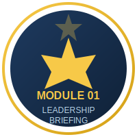
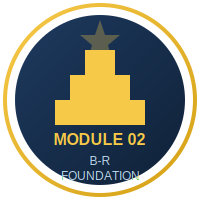
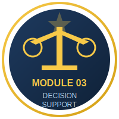
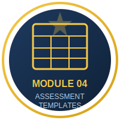
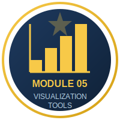
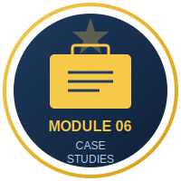
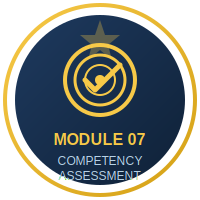
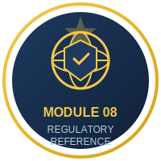
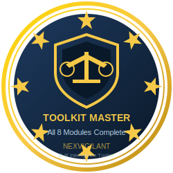

# Your Learning Progress

Track your journey through the NexVigilant Benefit-Risk Intelligence Toolkit.

---

## Module Completion Badges

Complete each module to earn your badges. Use the checkboxes below to track your personal progress.

### Core Modules

-   :material-crown:{ .lg .middle } **Module 1: Leadership Briefing**

    ---

    { width="120" align="right" }

    - [ ] Read the executive overview
    - [ ] Understand the business case
    - [ ] Review key decision points

    [:octicons-arrow-right-24: Start Module](modules/01-leadership-briefing.md)

-   :material-library:{ .lg .middle } **Module 2: B-R Foundation**

    ---

    { width="120" align="right" }

    - [ ] Learn core concepts
    - [ ] Study the framework
    - [ ] Complete practice exercises

    [:octicons-arrow-right-24: Start Module](modules/02-foundation.md)

-   :material-scale-balance:{ .lg .middle } **Module 3: Decision Support**

    ---

    { width="120" align="right" }

    - [ ] Explore decision frameworks
    - [ ] Learn MCDA principles
    - [ ] Practice with examples

    [:octicons-arrow-right-24: Start Module](modules/03-decision-support.md)

-   :material-file-document-multiple:{ .lg .middle } **Module 4: Assessment Templates**

    ---

    { width="120" align="right" }

    - [ ] Download BRAD template
    - [ ] Study Effects Table
    - [ ] Build a Value Tree

    [:octicons-arrow-right-24: Start Module](modules/04-assessment-templates.md)

### Advanced Modules

-   :material-chart-bar:{ .lg .middle } **Module 5: Visualization Tools**

    ---

    { width="120" align="right" }

    - [ ] Create forest plots
    - [ ] Build effects tables
    - [ ] Design value trees

    [:octicons-arrow-right-24: Start Module](modules/05-visualization-tools.md)

-   :material-briefcase:{ .lg .middle } **Module 6: Case Studies**

    ---

    { width="120" align="right" }

    - [ ] Analyze real-world cases
    - [ ] Apply learned frameworks
    - [ ] Discuss outcomes

    [:octicons-arrow-right-24: Start Module](modules/06-case-studies.md)

-   :material-bullseye-arrow:{ .lg .middle } **Module 7: Competency Assessment**

    ---

    { width="120" align="right" }

    - [ ] Complete self-assessment
    - [ ] Identify skill gaps
    - [ ] Pass knowledge checks

    [:octicons-arrow-right-24: Start Module](modules/07-competency-assessment.md)

-   :material-shield-check:{ .lg .middle } **Module 8: Regulatory Reference**

    ---

    { width="120" align="right" }

    - [ ] Study FDA requirements
    - [ ] Review EMA guidelines
    - [ ] Compare regional differences

    [:octicons-arrow-right-24: Start Module](modules/08-regulatory-reference.md)

---

## Master Certification

Complete all 8 modules to earn the **Toolkit Master** badge!

    
    
<em>Complete all modules to unlock this badge</em>

### Completion Checklist

Use this checklist to track your overall progress:

- [ ] **Module 1**: Leadership Briefing completed
- [ ] **Module 2**: B-R Foundation completed
- [ ] **Module 3**: Decision Support completed
- [ ] **Module 4**: Assessment Templates completed
- [ ] **Module 5**: Visualization Tools completed
- [ ] **Module 6**: Case Studies completed
- [ ] **Module 7**: Competency Assessment completed (including knowledge checks)
- [ ] **Module 8**: Regulatory Reference completed
- [ ] **Notebooks**: Completed at least one Jupyter tutorial
- [ ] **Templates**: Downloaded and reviewed all templates

---

## Printable Certificate

Once you've completed all modules, you can generate a certificate of completion.

[:material-certificate: Download Certificate Template](assets/certificate-template.html){ .md-button .md-button--primary }

---

## Share Your Achievement

Completed the toolkit? Share your accomplishment!

- **LinkedIn**: Post your completion with the hashtag `#BenefitRiskAssessment`
- **GitHub**: Star the [nv-BR-toolkit repository](https://github.com/nexvigilant/nv-BR-toolkit)
- **Discussion**: Join the conversation in [GitHub Discussions](https://github.com/nexvigilant/nv-BR-toolkit/discussions)

---

!!! info "Educational Disclaimer"
    This toolkit is provided for **educational purposes only**. Completion of these modules does not constitute professional certification. The materials should not be used for regulatory submissions without proper validation by qualified professionals.

---

*NexVigilant — Empowerment Through Vigilance*
