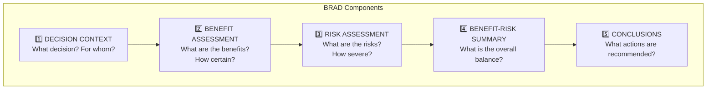

# BRAD Template

!!! abstract "Benefit-Risk Action Document"

    The BRAD is a living document that captures the evolving benefit-risk profile throughout a product's lifecycle.

[Download BRAD Template :material-download:](https://github.com/nexvigilant/nv-BR-toolkit/raw/main/templates/BRAD_Template.md){ .md-button .md-button--primary }

---

## What is a BRAD?

The **Benefit-Risk Action Document** was developed by FDA to provide a standardized structure for:

- Documenting B-R assessments throughout development
- Communicating with regulatory agencies
- Supporting internal decision-making
- Creating a living record that evolves with new data

---

## BRAD Structure

---

## Section Overview

### Section 1: Decision Context

Sets the stage for the assessment:

| Element | Description |
|---------|-------------|
| Indication | Disease/condition being treated |
| Population | Target patient characteristics |
| Comparator | What is the alternative? |
| Decision | What are we deciding? |
| Timeframe | When is decision needed? |

### Section 2: Benefit Assessment

Summarizes the efficacy evidence:

- Primary efficacy endpoints
- Secondary/supportive endpoints
- Subgroup analyses
- Benefit uncertainties

### Section 3: Risk Assessment

Characterizes the safety profile:

- Safety database overview
- Identified risks
- Potential risks
- Missing information

### Section 4: Benefit-Risk Summary

Integrates benefits and risks:

- Effects Table integration
- Value Tree alignment
- Quantitative analysis (if applicable)
- Overall balance assessment

### Section 5: Conclusions

Actionable recommendations:

- Approval/non-approval recommendation
- Labeling recommendations
- Risk minimization measures
- Post-marketing commitments

---

## Key Principles

!!! success "Best Practices"

    1. **Tell a story** — The BRAD should read as a coherent narrative
    2. **Be transparent** — Include uncertainties and limitations
    3. **Be balanced** — Don't oversell benefits or minimize risks
    4. **Be actionable** — Conclude with clear recommendations
    5. **Update regularly** — The BRAD is a living document

---

## Template Highlights

The downloadable template includes:

- **Placeholder text** — Clear indicators of what to include
- **Tables** — Pre-formatted for key data elements
- **Guidance** — Inline tips for completing each section
- **Document control** — Version tracking and sign-off
- **Appendices** — Structure for supporting materials

---

## Related Resources

| Resource | Description |
|----------|-------------|
| [Effects Table Template](effects-table.md) | Quantitative data for Section 4 |
| [Value Tree Template](value-tree.md) | Outcome identification for Section 4 |
| [Module 4: Assessment Templates](../modules/04-assessment-templates.md) | Detailed usage guidance |

---

**NexVigilant** | *Empowerment Through Vigilance*
