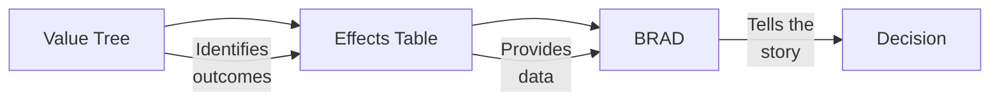

# Downloadable Templates

!!! abstract "Practical Tools"

    Ready-to-use templates for documenting benefit-risk assessments. Download, customize, and apply to your projects.

---

## Available Templates

| Template | Description | Format | Download |
|----------|-------------|--------|----------|
| **BRAD Template** | Benefit-Risk Action Document | Markdown | [View](brad.md) \| [Raw](https://github.com/nexvigilant/nv-BR-toolkit/raw/main/templates/BRAD_Template.md) |
| **Effects Table** | Structured B-R data presentation | Markdown | [View](effects-table.md) \| [Raw](https://github.com/nexvigilant/nv-BR-toolkit/raw/main/templates/Effects_Table_Template.md) |
| **Value Tree** | Hierarchical outcome identification | Markdown | [View](value-tree.md) \| [Raw](https://github.com/nexvigilant/nv-BR-toolkit/raw/main/templates/Value_Tree_Template.md) |

---

## How to Use These Templates

### Option 1: Web View

Browse the template documentation on this site to understand the structure and guidance before downloading.

### Option 2: Download Markdown

1. Click the "Raw" link above
2. Save the file to your computer
3. Open in any text editor or Markdown viewer
4. Customize for your assessment

### Option 3: Convert to Word/PDF

Markdown files can be easily converted:

```bash
# Using Pandoc (if installed)
pandoc BRAD_Template.md -o BRAD_Template.docx

# Or use online converters like:
# - https://cloudconvert.com/md-to-docx
# - https://dillinger.io/
```

---

## Template Relationship



| Step | Template | Purpose |
|------|----------|---------|
| 1 | **Value Tree** | Comprehensively identify all relevant outcomes |
| 2 | **Effects Table** | Quantify outcomes with data |
| 3 | **BRAD** | Integrate into decision narrative |

---

## Educational Disclaimer

!!! warning "For Learning Purposes"

    These templates are provided for **educational use only**. They should NOT be used for regulatory submissions without:

    - Internal review and validation
    - Alignment with company SOPs
    - Regulatory affairs approval
    - Quality assurance sign-off

---

## Template Features

### BRAD Template

- Complete 5-section structure aligned with FDA framework
- Section-by-section guidance
- Worked example text
- Document control and sign-off sections
- Appendix structure

### Effects Table Template

- Column definitions and guidance
- Metric selection guide (RR, OR, HR, NNT/NNH)
- Quality checklist
- Common mistakes to avoid
- Excel implementation notes
- Worked example with anti-inflammatory agent

### Value Tree Template

- Generic structure for any therapeutic area
- Step-by-step worksheet
- Validation checklist (completeness, non-redundancy, measurability)
- Three therapeutic area examples:
  - Rheumatoid Arthritis (biologic)
  - Oncology (immuno-oncology)
  - Vaccine
- MCDA conversion guidance

---

## Related Learning Modules

| Module | Template Connection |
|--------|---------------------|
| [Module 4: Assessment Templates](../modules/04-assessment-templates.md) | Detailed guidance on using all three templates |
| [Module 5: Visualization Tools](../modules/05-visualization-tools.md) | Visualizing Effects Table data |
| [Module 6: Case Studies](../modules/06-case-studies.md) | Complete examples using these templates |

---

## Feedback

Found an issue or have a suggestion for improving these templates?

- [Open an issue on GitHub](https://github.com/nexvigilant/nv-BR-toolkit/issues)
- Include specific details about the template and your suggestion

---

**NexVigilant** | *Empowerment Through Vigilance*
